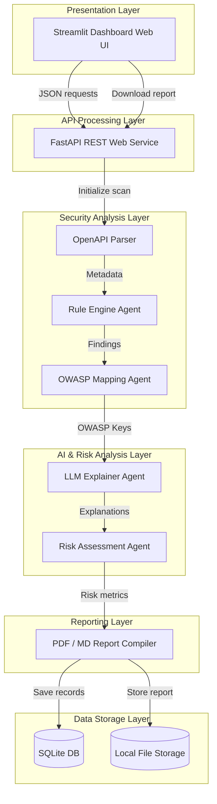
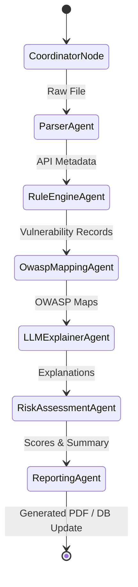

# API Security Review Agent: An AI-Driven DevSecOps Assessment Framework

This document represents the official software design specification, technical documentation, and project report for the **API Security Review Agent**.

---

## 1. Executive Summary

### What Problem Does This Project Solve?
Modern software systems rely heavily on microservices interconnected by Application Programming Interfaces (APIs). However, developers frequently publish APIs exposing critical design flaws, such as missing authentication, lack of rate limiting, insecure data serialization schemas, and authorization omissions. Traditional security testing (DAST/SAST) typically runs late in the Software Development Lifecycle (SDLC). The API Security Review Agent solves this by shifting security reviews "left" (early in the development cycle), analyzing API designs during the specification phase (OpenAPI/Swagger YAML or JSON) before any code is deployed or compiled.

### Why Do Organizations Need This Solution?
Manual security reviews are labor-intensive, require scarce DevSecOps expertise, and fail to keep pace with continuous integration and continuous deployment (CI/CD) speeds. Automated vulnerability scanners identify patterns but struggle to explain semantic business impact or provide contextual code repairs. Organizations need an automated, AI-powered system that reads API contracts, flags architectural gaps, maps vulnerabilities to industry standards (OWASP API Top 10), and produces developer-friendly explanations and mitigations.

### Limitations of Manual API Security Reviews
1. **Low Scalability**: Security architects cannot manually verify hundreds of changing API parameters and schemas in agile environments.
2. **Knowledge Bottlenecks**: Developers lack advanced cybersecurity threat-modeling capabilities.
3. **Inconsistent Quality**: Manual checklists vary between reviewers, leading to missed vulnerabilities.
4. **Delayed Feedback**: Reviews performed right before production release lead to costly redesign phases.

### Business Value Provided
- **Reduced Risk Exposure**: Blocks structural API vulnerabilities before deployment.
- **Cost Savings**: Resolving design flaws early reduces patching costs by up to $10\times$ compared to production fixes.
- **Improved developer productivity**: Provides automated code-remediation snippets, eliminating manual research.
- **Automated Compliance Audit**: Instantly generates PDF reports matching OWASP standards, proving regulatory compliance.

---

## 2. Functional Requirements

The API Security Review Agent implements the following core features:

| ID | Feature | Description |
| :--- | :--- | :--- |
| **FR-01** | **Spec File Upload** | Users upload OpenAPI/Swagger specifications in JSON, YAML, or YML formats. |
| **FR-02** | **Automated Parsing** | Programmatic parsing of spec documents, resolving local schemas (`$ref`) dynamically. |
| **FR-03** | **Metadata Extraction** | Extracts paths, HTTP methods, input parameters, response schemas, and authentication schemes. |
| **FR-04** | **Rule-Based Vulnerability Scan** | Checks extracted API structures against 20 predefined rule models. |
| **FR-05** | **OWASP Top 10 Mapping** | Associates rule violations with the 2023 OWASP API Security Top 10 risks. |
| **FR-06** | **AI Explanation Engine** | Invokes local LLMs (Ollama) or OpenAI to write business impact summaries. |
| **FR-07** | **Mitigation Generation** | Generates executable framework-level (FastAPI, Nginx, etc.) code patches. |
| **FR-08** | **Risk Scoring** | Calculates finding scores using $Severity \times Exploitability \times Exposure$. |
| **FR-09** | **Interactive Dashboard** | Displays visual KPI cards, charts, and detailed expandable result sheets. |
| **FR-10** | **Multi-Format Export** | Compiles professional reports in PDF (ReportLab) and Markdown formats. |
| **FR-11** | **Scan History Storage** | Persists specification histories, database findings, and scores in SQLite. |

---

## 3. System Architecture

The architecture is designed using a clean, layered approach, separating presentation logic, routing services, agent orchestrations, AI integrations, and data persistence.

### Architectural Diagram (Mermaid)



### Layer Responsibilities
1. **User Interface Layer**: Built using Streamlit to present metrics, file upload blocks, charts, scan lists, and detailed mitigations.
2. **API Processing Layer**: FastAPI acts as the orchestrating gateway, managing file save routines, routing, and report serving.
3. **Security Analysis Layer**: Executes structural parsing (resolving components) and runs 20 custom rule validations.
4. **AI Reasoning Layer**: Orchestrates LLM APIs (OpenAI/Ollama) or falls back to template models to produce contextual assessments.
5. **Reporting Layer**: Builds styled, printable PDF files and Markdown documents.
6. **Data Storage Layer**: SQLite stores relational models, and directories handle files.

---

## 4. Agentic Workflow Design

The core logic of the application is represented as an agentic state-machine compiled in **LangGraph**. A shared `AgentState` object is modified sequentially as it passes through nodes.

### LangGraph Agent workflow



### Agent Roles and Responsibilities
- **Coordinator Agent**: Receives scanning orders, sets up the workspace, manages the state, and records failures.
- **Parser Agent**: Validates OpenAPI JSON/YAML structure, resolves internal references, and outputs a uniform endpoint metadata structure.
- **Rule Engine Agent**: Scans the parser metadata against 20 specific structural rules and yields preliminary finding tuples.
- **OWASP Mapping Agent**: Correlates rule violations to the OWASP API Top 10 (2023) threat categories and attaches baseline mitigation rules.
- **LLM Explainer Agent**: Consults OpenAI/Ollama or local fallback engines to construct plain-English explanations and target remediation snippets.
- **Risk Assessment Agent**: Computes CVSS-style score rankings and establishes the overall security health grade of the API.
- **Reporting Agent**: Compiles output documents, saves reports to disk, and updates SQLite.

---

## 5. Security Rules

The Security Rule Engine implements 20 specific validation rules:

| Rule ID | Rule Name | Description / Detection Logic | Severity | Recommended Mitigation |
| :--- | :--- | :--- | :--- | :--- |
| **RULE_MISSING_AUTH** | Missing Auth Scheme | Operation or global security definitions are missing or empty. | HIGH | Enforce Authorization/Bearer headers globally. |
| **RULE_UNRESTRICTED_DELETE** | Unrestricted Delete | HTTP DELETE method exposed on any path without security constraints. | CRITICAL | Enforce strict RBAC and token validation. |
| **RULE_UNRESTRICTED_WRITE** | Unrestricted Write | HTTP PUT/PATCH/POST methods exposed without security constraints. | HIGH | Require bearer authentication tokens on write. |
| **RULE_SENSITIVE_QUERY_PARAMS** | Sensitive Params in URL | Query params contain keywords like password, secret, token, api_key. | HIGH | Move secrets to authorization headers or POST body. |
| **RULE_MISSING_RATE_LIMITING** | Missing Rate Limiting | Lack of `x-rate-limit` headers, parameters, or documentation. | MEDIUM | Integrate rate limit constraints at API gateway. |
| **RULE_EXCESSIVE_DATA_EXPOSURE** | Sensitive Data in Schema | Response schema contains properties like password, ssn, credit_card. | CRITICAL | Filter data using secure DTO serializer objects. |
| **RULE_WEAK_PROTOCOL** | Insecure Protocol | Target server configurations use `http://` schemes instead of `https://`. | HIGH | Force secure TLS encrypted transport (HTTPS). |
| **RULE_BASIC_AUTH_INSECURE** | Basic Auth Scheme | Security scheme specifies type HTTP basic (base64 username/pass). | HIGH | Upgrade to standard JWT bearer or OAuth2 tokens. |
| **RULE_MISSING_RESP_CONTENT_TYPE** | Missing Content-Type | Response status codes fail to declare exact content media type. | LOW | Explicitly configure response models (e.g. application/json). |
| **RULE_WILDCARD_CORS** | Wildcard CORS | CORS header configuration returns `Access-Control-Allow-Origin: *`. | MEDIUM | Bind access rules to dynamic lists of trusted domains. |
| **RULE_SQL_INJECTION_RISK** | Unvalidated String Parameter | String query/path params lack length limits or pattern constraints. | MEDIUM | Add input format checking schemas (regex pattern rules). |
| **RULE_DANGEROUS_FILE_UPLOAD** | Unrestricted File Upload | Multipart upload endpoint fails to state max size bounds. | HIGH | Validate file type extensions and restrict max upload sizes. |
| **RULE_MISSING_BODY_LIMIT** | Missing Payload Limit | Schema doesn't define maximum properties or object size constraints. | LOW | Add validation criteria to prevent parsing buffers exhaust. |
| **RULE_METHOD_OVERRIDE_ENABLED** | HTTP Method Override | Swagger parameters allow `X-HTTP-Method-Override` headers. | MEDIUM | Disable method overriding parsing rules in server. |
| **RULE_WEAK_TOKEN_USAGE** | Token in Query Param | Uses custom apiKey query credentials instead of Bearer headers. | MEDIUM | Migrate token verification to request headers. |
| **RULE_NO_INPUT_VALIDATION** | No Parameter Constraints | Parameters have type number/string but lack constraints (min/max). | MEDIUM | Add range validations for all numeric/string inputs. |
| **RULE_MISSING_ENUM_CONSTRAINTS** | State/Role Missing Enum | Parameters named status, role, state lack enum definitions. | LOW | Define explicit valid options arrays in schema. |
| **RULE_INFO_EXPOSURE_HEADERS** | Server Signature Exposed | Response headers return server indicators like Server or X-Powered-By. | LOW | Strip signature headers at the proxy/gateway level. |
| **RULE_PUBLIC_ADMIN_PANEL** | Public Admin Panel | Path names containing `/admin` or `/management` lack auth requirements. | CRITICAL | Limit path routing to authorized scopes and IP filters. |
| **RULE_INSECURE_IDOR_RISK** | Path IDOR Risk | Routes use sequential integer placeholders (e.g. `/user/{id}`). | HIGH | Replace indexes with UUIDs and verify user ownership. |

---

## 6. OWASP API Security Top 10 Integration

The system maps rule findings to the **OWASP API Security Top 10 (2023)** standard:

### API1:2023 - Broken Object Level Authorization (BOLA)
- **Description**: Exposing resource identifiers directly without verifying if the requesting user owns that resource.
- **Example Vulnerable Endpoint**: `GET /invoices/{invoiceId}` (where an attacker can sweep `invoiceId` numbers).
- **Prevention**: Check session-to-object ownership at the query layer. Use random UUIDv4 identifiers.

### API2:2023 - Broken Authentication
- **Description**: Authentication implementations containing flaws that allow attackers to bypass login constraints.
- **Example Vulnerable Endpoint**: `GET /users/profile?api_key=secret_value` (token exposure in logs).
- **Prevention**: Enforce short-lived JWT signatures and utilize HTTPS-only headers.

### API3:2023 - Broken Object Property Level Authorization
- **Description**: Lack of input/output schema filtering, exposing sensitive data properties or allowing users to modify administrative properties.
- **Example Vulnerable Endpoint**: `POST /users/profile` accepting `{"role": "admin"}` (mass assignment).
- **Prevention**: Define explicit response schemas excluding password hashes and internal flags.

### API4:2023 - Unrestricted Resource Consumption
- **Description**: Lack of rate limiting or payload constraints, making the service vulnerable to denial of service (DoS).
- **Example Vulnerable Endpoint**: `POST /users/avatar` (accepting unlimited file sizes).
- **Prevention**: Apply rate limiters (requests/IP/minute) and strict payload size checks.

### API5:2023 - Broken Function Level Authorization
- **Description**: Exposing admin endpoints to non-admin users due to poor authorization checks on specific paths or HTTP methods.
- **Example Vulnerable Endpoint**: `DELETE /admin/deleteUser/{id}` callable by any authenticated user.
- **Prevention**: Implement explicit role checks on every routing path.

### API8:2023 - Security Misconfiguration
- **Description**: Plaintext communication protocols, default configurations, verbose errors, or wildcard CORS settings.
- **Example Vulnerable Endpoint**: Target server running on plain HTTP protocol: `http://api.production.com`.
- **Prevention**: Enforce HTTPS, disable directory indexing, and restrict CORS headers.

### API10:2023 - Unsafe Consumption of APIs / Injection
- **Description**: Passing unvalidated client inputs directly to backend databases or parsers.
- **Example Vulnerable Endpoint**: `GET /search?query=val` where `query` is passed directly to SQL.
- **Prevention**: Validate inputs against strict regex schemas and use parameterized database queries.

---

## 7. LLM Integration

### Why an LLM is Needed
Rule engines detect structural flaws but cannot explain the context of a vulnerability or write custom remediation code. Large Language Models (LLMs) bridge this gap by explaining the threat in plain English and writing custom, copy-pasteable code patches (e.g., FastAPI middleware, Nginx rules) based on the detected vulnerability.

### Prompt Engineering Strategy
We use system instructions to prompt the LLM to act as a senior DevSecOps engineer. To prevent formatting issues, we require the model to return structured JSON containing exactly two fields: `explanation` and `mitigation_snippet`.

### Preventing Hallucinations
1. **Low Temperature**: Set temperature to `0.2` to ensure factual, consistent outputs.
2. **Deterministic Fallback**: If LLM connections fail, the system falls back to a detailed pre-compiled knowledge base. This ensures the application remains functional even offline.
3. **Structured Schemas**: Enforcing JSON output structures reduces parse failures.

### Example LLM Prompt
```text
System: You are an API Security AI. Explain the security vulnerability and mitigation. You must output JSON format with 'explanation' and 'mitigation_snippet' keys. Do not include markdown code block formatting outside the JSON.

Task:
Vulnerability ID: RULE_UNRESTRICTED_DELETE
HTTP Location: DELETE /admin/deleteUser/{id}

Please output a JSON response containing:
1. 'explanation': A 2-3 sentence explanation of why this configuration is vulnerable and what an attacker could do.
2. 'mitigation_snippet': A styled markdown code snippet showing how to fix it in a programming framework.
```

### Example LLM Output
```json
{
  "explanation": "Exposing a DELETE route on an administrative path without authentication allows anyone on the internet to delete user accounts. Attackers can execute script loops to wipe your database, leading to data loss and service disruption.",
  "mitigation_snippet": "```python\nfrom fastapi import Depends, HTTPException, Security\nfrom app.auth import get_admin_user\n\n@app.delete('/admin/deleteUser/{id}')\ndef delete_user(id: int, current_user = Depends(get_admin_user)):\n    db.delete_user_by_id(id)\n    return {'status': 'success'}\n```"
}
```

---

## 8. Risk Scoring Methodology

The risk score of a finding represents the likelihood and impact of a vulnerability being exploited.

### Formula
$$\text{Risk Score} = \text{Severity} \times \text{Exploitability} \times \text{Exposure}$$

- **Severity (S)**: The baseline impact of the vulnerability class (Critical = 5.0, High = 4.0, Medium = 3.0, Low = 2.0).
- **Exploitability (Ex)**: How easy it is to exploit the flaw (e.g., Missing Authentication is 5.0, SQL Injection is 4.0, exposed server headers is 1.5).
- **Exposure (Ep)**: The accessibility of the endpoint (Public = 5.0, Authenticated = 3.0, Internal = 1.0).

### Thresholds
- **Critical Risk**: Score $\ge 80.0$
- **High Risk**: Score $60.0 \text{--} 79.9$
- **Medium Risk**: Score $40.0 \text{--} 59.9$
- **Low Risk**: Score $< 40.0$

### Risk Score Calculation Example
For **Unrestricted DELETE** on `/admin/deleteUser/{id}`:
- **Severity**: $5.0$ (Critical)
- **Exploitability**: $5.0$ (Requires only a simple HTTP request tool)
- **Exposure**: $4.5$ (Endpoint is public)
$$\text{Raw Score} = 5.0 \times 5.0 \times 4.5 = 112.5$$
*Capped at $100.0$ max.* **Risk Level: CRITICAL (Score = 100.0)**

---

## 9. Technology Stack

We selected the following technologies to ensure simplicity, scalability, and ease of deployment:

1. **Python**: The standard language for AI, data parsing, and scripting.
2. **FastAPI**: A high-performance, asynchronous web framework for building APIs.
3. **Streamlit**: Enables rapid creation of interactive data dashboards using clean Python code.
4. **LangGraph**: Orchestrates our multi-agent workflow, managing agent states and execution order.
5. **Ollama / OpenAI**: Ollama runs models locally (Llama 3, Mistral) for privacy and zero API costs, while OpenAI provides cloud-based analysis.
6. **SQLite**: A lightweight, serverless relational database that stores scan logs.
7. **Pydantic**: Validates input data structures and enforces strict types.
8. **ReportLab**: Generates multi-page PDF reports programmatically.
9. **PyYAML**: Parses YAML-based OpenAPI specifications.

---

## 10. Folder Structure

```
api-security-review-agent/
├── app/
│   ├── __init__.py
│   ├── config.py                 # Configuration settings (DB paths, LLM keys)
│   ├── database.py               # SQLite schemas and database operations
│   ├── backend_api.py            # FastAPI application backend (Backend API)
│   ├── frontend_dashboard.py     # Streamlit dashboard frontend (Frontend Dashboard)
│   ├── agents/                   # LangGraph agent definitions
│   │   ├── __init__.py
│   │   ├── graph.py              # LangGraph workflow compiler
│   │   ├── coordinator.py        # Workflow execution coordinator
│   │   ├── rule_agent.py         # 20-rule scanner agent
│   │   ├── owasp_agent.py        # OWASP compliance mapping agent
│   │   ├── llm_agent.py          # AI Explainer & mitigation generator
│   │   ├── risk_agent.py         # Risk scoring calculations
│   │   └── report_agent.py       # PDF/Markdown exporter
│   ├── parsers/                  # Spec parser classes
│   │   ├── __init__.py
│   │   └── openapi_parser.py     # OpenAPI structure parser
│   └── utils/                    # Exporter utilities
│       ├── __init__.py
│       └── pdf_generator.py      # PDF builder (ReportLab)
├── docs/                         # Documentation and reports
│   └── PROJECT_REPORT.md         # Final-year project report
├── tests/                        # Tests directory
│   ├── __init__.py
│   ├── test_rules.py             # Rule unit tests
│   └── sample_vulnerable_openapi.yaml  # Test spec fixture
├── Dockerfile                    # Containerization configuration
├── docker-compose.yml            # Local multi-service orchestrator
├── requirements.txt              # Project dependencies
└── README.md                     # Running guide
```

---

## 11. Database Design

We use SQLite to persist data. The database schema is defined as follows:

```sql
-- 1. specifications table
CREATE TABLE specifications (
    id INTEGER PRIMARY KEY AUTOINCREMENT,
    filename TEXT NOT NULL,
    content_type TEXT NOT NULL,
    file_path TEXT NOT NULL,
    uploaded_at TEXT NOT NULL
);

-- 2. scans table
CREATE TABLE scans (
    id INTEGER PRIMARY KEY AUTOINCREMENT,
    spec_id INTEGER NOT NULL,
    status TEXT NOT NULL,
    total_endpoints INTEGER DEFAULT 0,
    critical_count INTEGER DEFAULT 0,
    high_count INTEGER DEFAULT 0,
    medium_count INTEGER DEFAULT 0,
    low_count INTEGER DEFAULT 0,
    overall_score REAL DEFAULT 0.0,
    started_at TEXT NOT NULL,
    completed_at TEXT,
    FOREIGN KEY (spec_id) REFERENCES specifications(id) ON DELETE CASCADE
);

-- 3. findings table
CREATE TABLE findings (
    id INTEGER PRIMARY KEY AUTOINCREMENT,
    scan_id INTEGER NOT NULL,
    path TEXT NOT NULL,
    method TEXT NOT NULL,
    rule_id TEXT NOT NULL,
    rule_name TEXT NOT NULL,
    severity TEXT NOT NULL,
    description TEXT NOT NULL,
    owasp_category TEXT,
    owasp_title TEXT,
    exploitability REAL,
    exposure REAL,
    business_impact REAL,
    score REAL,
    explanation TEXT,
    mitigation TEXT,
    FOREIGN KEY (scan_id) REFERENCES scans(id) ON DELETE CASCADE
);

-- 4. reports table
CREATE TABLE reports (
    id INTEGER PRIMARY KEY AUTOINCREMENT,
    scan_id INTEGER NOT NULL,
    file_path TEXT NOT NULL,
    format TEXT NOT NULL,
    created_at TEXT NOT NULL,
    FOREIGN KEY (scan_id) REFERENCES scans(id) ON DELETE CASCADE
);
```

---

## 12. Implementation Roadmap

An 8-week development plan for a team of 4 students:

```
[Week 1: Specs & Parsing] ──> [Week 2: 20 Rules Engine] ──> [Week 3: SQLite & FastAPI]
                                                                     │
                                                                     ▼
[Week 6: LangGraph Agent] <── [Week 5: PDF Reports] <── [Week 4: Streamlit UI]
            │
            ▼
[Week 7: Docker & CI/CD] ──> [Week 8: Testing & Presentation]
```

### Week 1: Specification Parsing
- **Objective**: Parse OpenAPI JSON/YAML files.
- **Deliverables**: Python script to load specs and resolve references.
- **Milestone**: Parser successfully extracts endpoints, methods, and schemas.
- **Testing**: Test parser against standard OpenAPI templates.

### Week 2: Security Rules Engine
- **Objective**: Code the 20 security rules.
- **Deliverables**: Rule check module that returns finding metadata.
- **Milestone**: Automatically flag missing auth and IDOR issues in test files.
- **Testing**: Verify rules using mock endpoints.

### Week 3: Database & Backend
- **Objective**: Create the SQLite database and FastAPI backend.
- **Deliverables**: DB schema, startup scripts, and REST API endpoints.
- **Milestone**: Upload files and view scan records via REST API.
- **Testing**: Validate CRUD endpoints.

### Week 4: Streamlit Dashboard UI
- **Objective**: Build the interactive web UI.
- **Deliverables**: Metric cards, file upload inputs, and detail viewer.
- **Milestone**: Load scan results and render interactive charts.
- **Testing**: Manual UI verification using different browsers.

### Week 5: PDF Reports Exporter
- **Objective**: Implement PDF and Markdown exports.
- **Deliverables**: ReportLab PDF compiler module.
- **Milestone**: Generate styled, multi-page PDF reports.
- **Testing**: Verify report layout with long text inputs.

### Week 6: LangGraph Integration
- **Objective**: Compile the LangGraph agentic workflow.
- **Deliverables**: StateGraph configurations.
- **Milestone**: Complete sequential execution of parser, rule engine, LLM explainer, and reporter.
- **Testing**: Run integration test suite using PyTest.

### Week 7: Dockerization & CI/CD
- **Objective**: Containerize the app and add CI/CD pipelines.
- **Deliverables**: Dockerfile, docker-compose.yml, and GitHub Actions scripts.
- **Milestone**: Build and run services using a single docker-compose command.
- **Testing**: Verify CI/CD pipeline runs tests automatically on push.

### Week 8: Final Testing & Presentation
- **Objective**: Complete final project evaluations.
- **Deliverables**: Walkthrough demo videos, viva prep questions, and project report.
- **Milestone**: Zero critical bugs found.
- **Testing**: Comprehensive system validation.

---

## 13. Testing Strategy

### Unit Testing
We test individual modules (parser extraction, rule engine checks) using Pytest.
```bash
# Run unit tests
pytest tests/
```

### Integration Testing
Validates the entire data pipeline: uploads an OpenAPI spec, runs the scan, and checks that findings are logged in the SQLite database.

### Agent Testing
Ensures the LangGraph state updates correctly at each node and resolves references successfully.

### Security Testing
Verifies the application does not expose sensitive endpoints or allow directory traversal attacks when downloading reports.

### Performance Testing
Measures spec parsing times. Large specs (50+ paths) should parse in under 2 seconds.

---

## 14. Deployment Strategy

### Local Deployment
Ensure Python 3.10 is installed, then run:
```bash
# Install dependencies
pip install -r requirements.txt

# Run backend API
uvicorn app.backend_api:app --host 127.0.0.1 --port 8000 --reload

# Run dashboard frontend (in a separate terminal)
streamlit run app/frontend_dashboard.py
```

### Docker Deployment
Build and run the entire application using docker-compose:
```bash
# Start backend and frontend services
docker-compose up --build
```
Access the Streamlit Dashboard at `http://localhost:8501`.

### CI/CD Integration
GitHub Actions configuration (`.github/workflows/security-scan.yml`):
```yaml
name: API Security scan CI

on: [push, pull_request]

jobs:
  build-and-test:
    runs-on: ubuntu-latest
    steps:
      - uses: actions/checkout@v3
      - name: Set up Python
        uses: actions/setup-python@v4
        with:
          python-level: '3.10'
      - name: Install dependencies
        run: |
          pip install -r requirements.txt
      - name: Run PyTest Suite
        run: |
          pytest tests/
```

---

## 15. Future Enhancements

1. **Live API Traffic Scanning**: Integrate with API gateways (Apigee, Kong) to capture and inspect live network traffic.
2. **PR Automated Code Reviewer**: Run automatically on GitHub Pull Requests, commenting on vulnerabilities directly in the code diff.
3. **Fine-Tuned Security LLM**: Fine-tune a smaller, open-source model (e.g., Llama-3 8B) on API vulnerability datasets to run on low-end servers.
4. **Vulnerability Trends Dashboard**: Display vulnerability trends over time across different projects.

---

## 16. Presentation Preparation

### Slide 1: Title
**Design and Development of an AI-Driven API Security Review Framework for DevSecOps Environments**
*Final Year B.Tech CSBS Project*

### Slide 2: Problem Statement
APIs are the primary target for modern cyberattacks. Developers often expose endpoints with design flaws (BOLA, missing rate limits), and manual security reviews are slow, inconsistent, and hard to scale.

### Slide 3: Project Objectives
Create an AI-powered DevSecOps assistant that automatically parses OpenAPI specs, detects vulnerabilities, maps findings to OWASP categories, and generates developer-friendly reports.

### Slide 4: System Architecture
*Highlight the layered architecture using the system architecture diagram.*

### Slide 5: LangGraph Multi-Agent Workflow
*Show the flow from parser to rules engine, mapping, risk assessment, and report generation.*

### Slide 6: Demo Execution Flow
1. Upload OpenAPI YAML file.
2. View real-time parsing.
3. Inspect security findings, OWASP mappings, and AI mitigations.
4. Download the generated PDF report.

### Slide 7: Conclusion
The API Security Review Agent shifts security reviews left, saving time for security teams and helping developers fix vulnerabilities early.

---

## 17. Viva Questions and Answers

### Q1: What is the core objective of this project?
To build an AI-powered DevSecOps assistant that automatically scans OpenAPI/Swagger specifications, identifies vulnerabilities, maps them to the OWASP API Security Top 10, calculates risk scores, and generates PDF reports with AI-suggested mitigations.

### Q2: What is the benefit of scanning the OpenAPI specification instead of the running API?
It shifts security left. Scanning the specification allows you to find design flaws early in the design phase, before any code is written or deployed.

### Q3: What is BOLA (Broken Object Level Authorization)?
BOLA (API1:2023) occurs when an API exposes endpoints that use database identifiers directly. Attackers can manipulate these IDs in the URL (e.g., `/user/101` to `/user/102`) to access other users' data.

### Q4: How does your system detect BOLA programmatically?
The rule engine flags paths containing sequential integer parameters (e.g., `{id}` of type `integer`) that lack authorization scopes or security checks.

### Q5: What is the difference between Swagger and OpenAPI?
OpenAPI is the official specification standard, while Swagger refers to the original tools (Swagger UI, Swagger Editor) developed by SmartBear. Swagger 2.0 was renamed to OpenAPI 3.0.

### Q6: How does your system handle local references ($ref) in YAML files?
We built a recursive reference resolver in Python that parses the file, searches for `$ref` keys, resolves their paths (e.g., `#/components/schemas/User`), and replaces them with their actual definitions.

### Q7: Why is exposing sensitive parameters in URL queries dangerous?
Query parameters are logged by web servers, proxy servers, browser history, and diagnostic logs. If an API key or password is passed in the query parameter, it will be exposed in plain text in these logs.

### Q8: What is the risk of a wildcard CORS header?
`Access-Control-Allow-Origin: *` allows any website to make requests to your API and read the responses. This can lead to cross-site data exposure if authentication sessions are intercepted.

### Q9: Why do you need both a rule engine and an LLM?
The rule engine handles the fast, deterministic detection of structural vulnerabilities, while the LLM provides contextual explanations of the threats and writes custom code fixes.

### Q10: How does your system work if there is no internet connection or API keys?
We built a deterministic fallback engine with a pre-compiled security knowledge base. If the LLM connection fails, the system loads these templates to provide detailed explanations and code mitigations without crashing.

### Q11: Explain your risk scoring formula.
$$Score = Severity \times Exploitability \times Exposure$$
We map severity to numeric values (Critical = 5, Low = 2), assess how easily a vulnerability can be exploited, and determine the exposure of the endpoint. The raw score is capped at 100.

### Q12: Why did you choose FastAPI for the backend?
FastAPI is extremely fast, supports asynchronous requests, automatically generates OpenAPI documentation for its own routes, and integrates seamlessly with Pydantic schemas.

### Q13: What role does LangGraph play in your project?
LangGraph manages our multi-agent workflow. It compiles a state-machine where each agent (parser, rule engine, LLM explainer) is a node that processes and updates a shared scan state.

### Q14: How does the system prevent LLM hallucinations?
We set the LLM temperature to `0.2` for factual consistency, enforce structured JSON schemas for outputs, and use a local template fallback to prevent failures.

### Q15: How can this tool be integrated into a CI/CD pipeline?
You can run a script during the build phase that uploads the OpenAPI spec to the backend. If the scan returns critical vulnerabilities, the script fails the build, preventing insecure code from deploying.

### Q16: How does SQLite support this application?
It acts as a lightweight, relational database to store specification file metadata, historical scans, vulnerability findings, and generated report file paths.

### Q17: What is rate limiting and why is it important?
Rate limiting controls the number of requests a client can make in a given timeframe. It protects APIs from brute-force attacks, DDoS attacks, and resource exhaustion.

### Q18: What is the difference between authentication and authorization?
Authentication verifies *who* a user is (e.g., checking credentials), while authorization verifies *what* they are allowed to do (e.g., checking if they have admin permissions).

### Q19: What is SSRF (Server-Side Request Forgery)?
SSRF (API7:2023) occurs when an API fetches a remote resource from a user-supplied URL without validation, allowing attackers to make the server query internal network locations.

### Q20: How does your system detect dangerous file upload vulnerabilities?
It flags POST/PUT endpoints accepting `multipart/form-data` payloads that do not specify file upload constraints (like `x-max-file-size` or allowed extensions).

### Q21: What is a DTO (Data Transfer Object) and how does it prevent data exposure?
A DTO is a data model used to serialize and transfer data. By using DTOs, you can define exactly which fields are sent in API responses, ensuring internal fields (like passwords) are excluded.

### Q22: What is dynamic MIME sniffing?
If a response does not specify a `Content-Type`, browsers might sniff the content and interpret JSON text as executable HTML, potentially triggering Cross-Site Scripting (XSS).

### Q23: Why did you choose SQLite over PostgreSQL for the initial build?
SQLite is serverless, lightweight, requires zero setup, and stores data in a single local file. This makes it ideal for local testing, rapid prototyping, and student presentations.

### Q24: What is SQL Injection?
SQL Injection occurs when unvalidated user input is concatenated directly into SQL queries, allowing attackers to manipulate query structures to read or delete database records.

### Q25: How does input validation mitigate injection attacks?
Enforcing constraints like minimum/maximum lengths and regex match patterns (e.g., only alphanumeric characters) blocks malicious payloads before they reach the database query layer.

### Q26: What is the benefit of containerizing the application with Docker?
Docker packages the frontend, backend, database, and all dependencies into a single container. This ensures the application runs consistently on any machine, regardless of the host OS.

### Q27: How does your PDF generator prevent text overflow in reports?
We use ReportLab's `Paragraph` flowable components wrapped inside `Table` cells with explicit column widths. This automatically wraps text based on the column boundaries.

### Q28: How does the system calculate the overall security health score?
We start with a base score of 100 and deduct points based on the number and severity of findings (e.g., -15 for Critical, -10 for High). The deduction is scaled against the total number of endpoints to ensure fairness.

### Q29: What is sequential multi-agent execution?
It is a workflow where agents run in a defined order. Each agent completes its task and updates a shared state before passing it to the next agent.

### Q30: How can this tool be extended to scan live API endpoints?
By integrating with API gateways or reverse proxies to inspect live HTTP traffic in real time, comparing active payloads and headers against your security rules.
